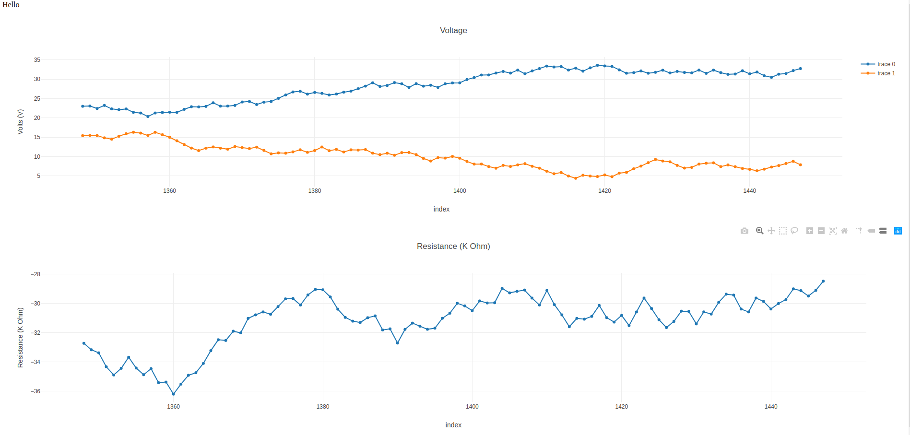

# node_basic_3

## misc

note: need to install sqlite3 first



## Usage

```	
node server.js

visit plotter/index.html

python poster.py

```

## notes on this version

implements a basic 'streaming' functionality

fetches the last N rows of data, and replots all the plots, at intervals

