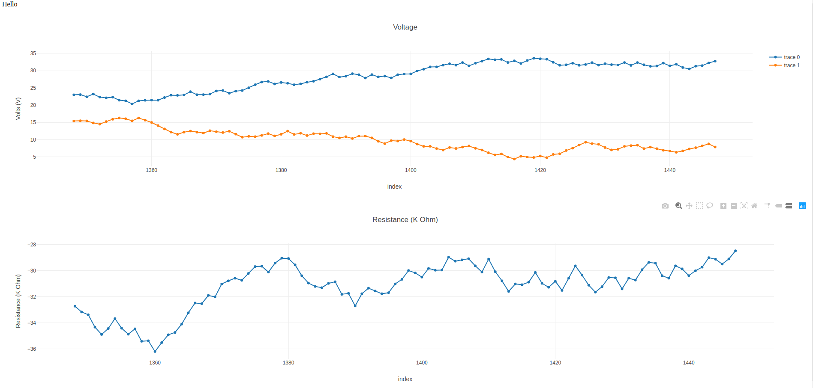

# node_basic_2



## Usage

```	
node server.js

visit plotter/index.html

python poster.py

```

## notes on this version

implements a basic 'streaming' functionality

fetches all the data, and replots all the plots, at intervals

## references
 
https://developerhowto.com/2018/12/29/build-a-rest-api-with-node-js-and-express-js/

https://github.com/fraigo/node-express-rest-api-example

# node-express-rest-api-example

A Basic Node.js/Express REST API implementation example.


now try to implement front end:

https://github.com/pverrecchia/Raspberry-Pi-weather-dashboard/blob/master/node/index.html
