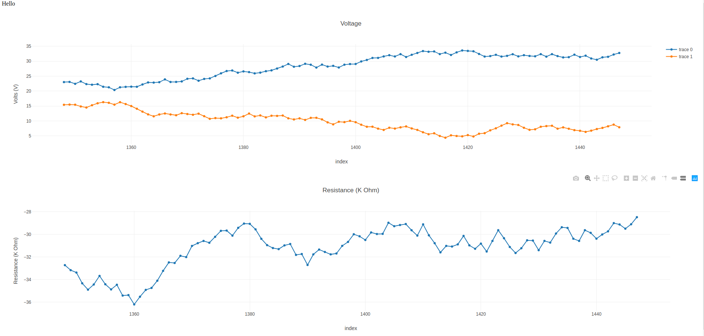

# node_basic_3



## Usage

```	
node server.js

visit plotter/index.html

python poster.py

```

## notes on this version

implements a basic 'streaming' functionality

fetches the last N rows of data, and replots all the plots, at intervals

## installing sqllite nodejs stuff on a pi

https://github.com/mapbox/node-sqlite3/issues/933

